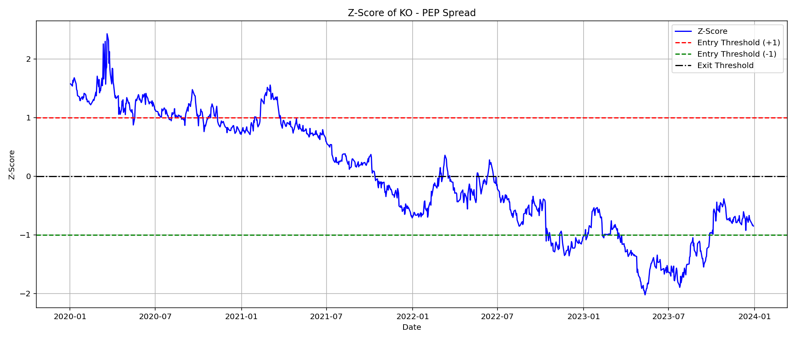
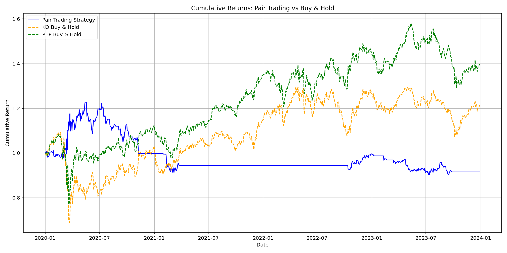

# Pair Trading Strategy: KO vs PEP

This project implements a mean-reversion pair trading strategy using Coca-Cola (KO) and PepsiCo (PEP).

## 📊 Strategy Logic
- Calculate spread between KO and PEP
- Normalize the spread into a Z-score
- Generate trading signals when spread diverges (Z-score > +1 or < -1)
- Exit when spread reverts (Z-score ~ 0)

## 🛠️ Tech Stack
- Python
- yfinance
- matplotlib
- pandas
- numpy

## 📈 Sample Output

